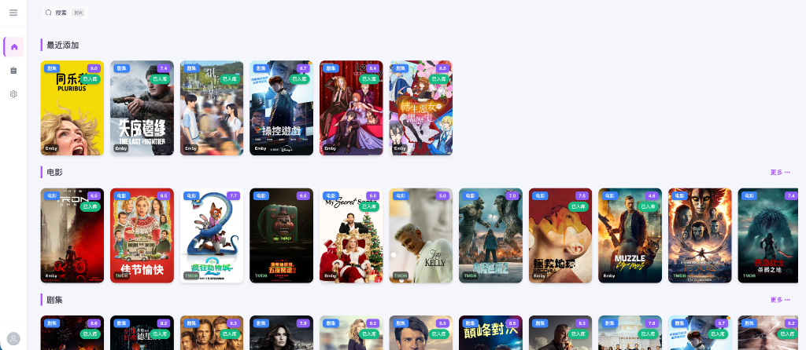
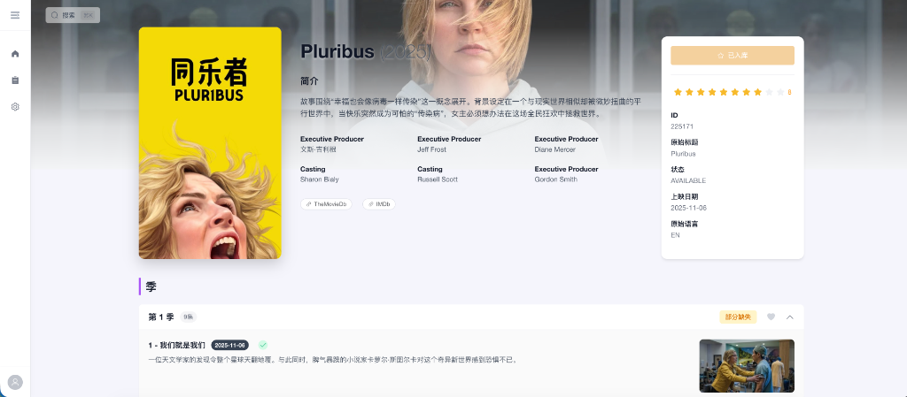
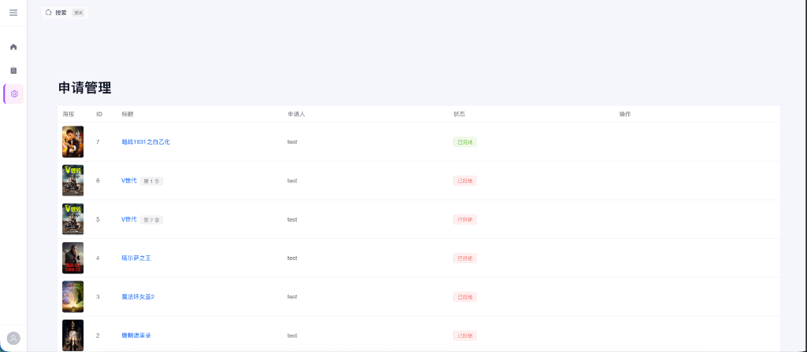
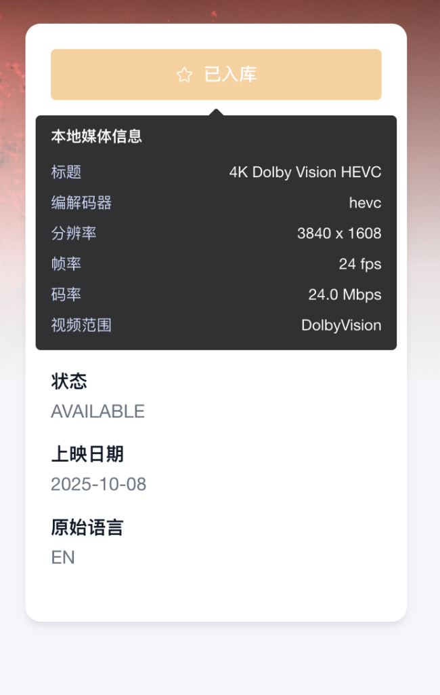

# Emby Subscription Manager

<div align="center">
  
</div>

<br/>

<div align="center">

[](https://vuejs.org/)
[](https://www.typescriptlang.org/)
[](https://fastapi.tiangolo.com/)
[](https://www.python.org/)
[](LICENSE)

</div>

## 📖 简介 | Introduction

**Emby Subscription Manager** 是一个连接 **TMDB** (元数据) 和 **Emby** (媒体服务器) 的现代化订阅管理工具。

它允许用户浏览热门影视内容，查看 Emby 库内的实时状态，并提交订阅申请。管理员审批通过后，系统将自动监测 Emby 入库情况并通知用户。系统采用模块化架构设计，旨在提供流畅的媒体发现与订阅体验。

> **Emby Subscription Manager** is a bridge between **TMDB** and your **Emby** Media Server. It allows users to discover trending media, check library status, and request subscriptions. Once approved, the system automatically monitors Emby for availability and notifies the user.

## ✨ 核心功能 | Features

- 🎬 **媒体发现 (Media Discovery)**
  - 集成 TMDB API，展示热门电影、电视剧及动漫。
  - 类似 Jellyseerr 的现代化 UI，包含 Hero 轮播图和横向滚动列表。
  - 实时检查 Emby 库状态（已入库/未入库）。

- 📝 **订阅管理 (Subscription System)**
  - **用户**: 一键提交订阅申请，支持添加备注。
  - **管理员**: 统一管理后台，支持审批（同意/拒绝）申请。
  - **自动化**: 定时任务自动扫描 Emby 新增媒体，自动更新订阅状态。

- 🔐 **无缝认证 (Seamless Auth)**
  - 支持 Emby 账号直接登录（代理认证）。
  - 自动同步 Emby 用户角色（管理员/普通用户）。

- 🔔 **通知系统 (Notifications)**
  - 站内消息通知，第一时间告知用户影片入库情况。

## 📸 预览 | Screenshots

| 媒体详情页 | 申请管理后台 |
| :---: | :---: |
|  |  |

| 媒体信息展示 |
| :---: |
|  |

## 🛠️ 技术栈 | Tech Stack

### 前端 (Frontend)
- **框架**: Vue 3 + Vite
- **语言**: TypeScript
- **UI 组件库**: Element Plus
- **状态管理**: Pinia
- **HTTP 客户端**: Axios

### 后端 (Backend)
- **框架**: FastAPI
- **语言**: Python 3.10+
- **数据库**: SQLite + SQLModel
- **定时任务**: APScheduler
- **集成**: TMDB API, Emby Server API

## 🚀 快速开始 | Getting Started

### 前置要求 (Prerequisites)
- Python 3.10+
- Node.js 16+
- Emby Server
- TMDB API Key

### 后端启动 (Backend)

```bash
cd back-end

# 创建虚拟环境
python -m venv venv
source venv/bin/activate  # Windows: venv\Scripts\activate

# 安装依赖
pip install -r requirements.txt

# 配置环境变量 (参考 env.example)
cp env.example .env
# 编辑 .env 填入 EMBY_HOST, EMBY_API_KEY, TMDB_API_KEY 等

# 运行服务
python src/main.py
```

### 前端启动 (Frontend)

```bash
cd front-end

# 安装依赖
npm install

# 运行开发服务器
npm run dev
```

## 🗺️ 路线图 | Roadmap

- [x] 基础架构搭建 (Vue3 + FastAPI)
- [x] Emby 代理登录与用户同步
- [x] TMDB 媒体发现与搜索
- [x] 订阅申请与审批流程
- [x] Emby 入库自动检测
- [ ] 对接 MoviePilot 实现自动化下载 (Planned)
- [ ] 更多通知渠道 (Telegram/WeChat) (Planned)

## 📄 许可证 | License

本项目采用 [MIT](LICENSE) 许可证。
